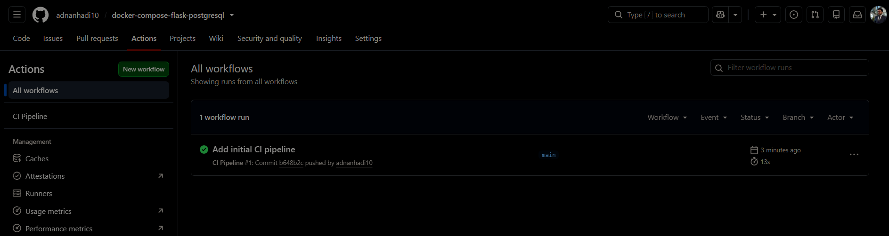
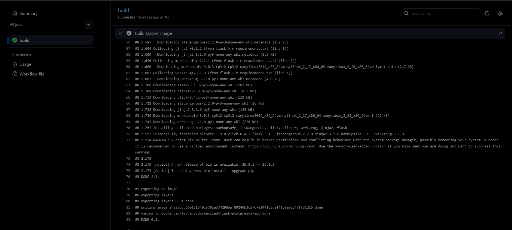
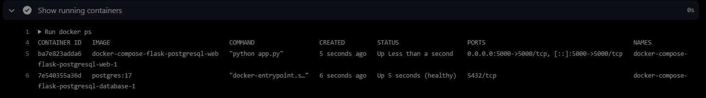
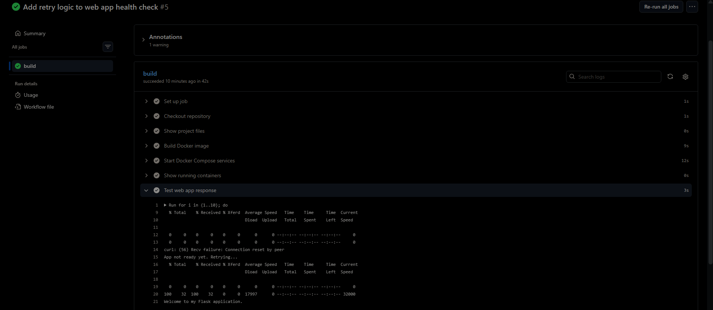
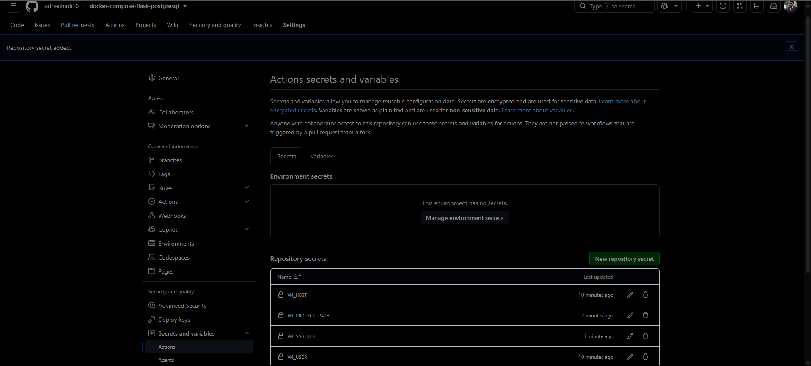
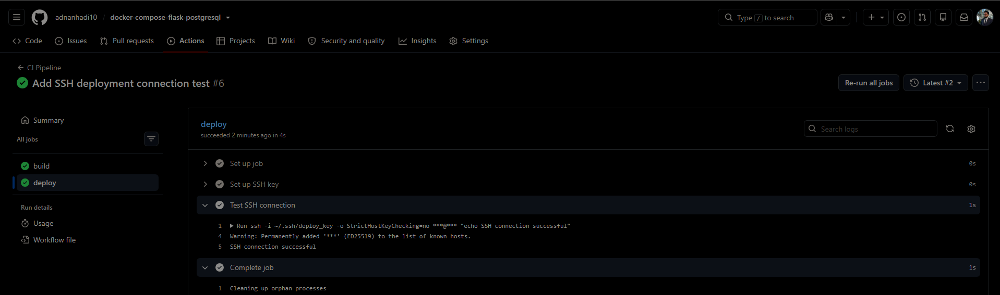
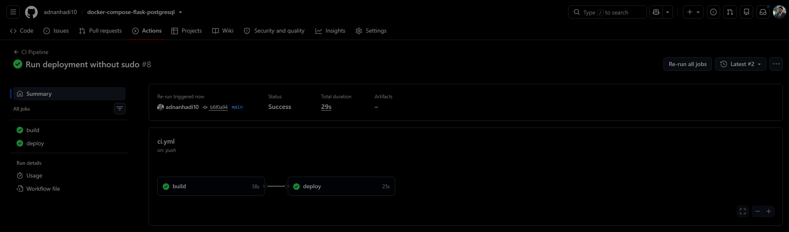
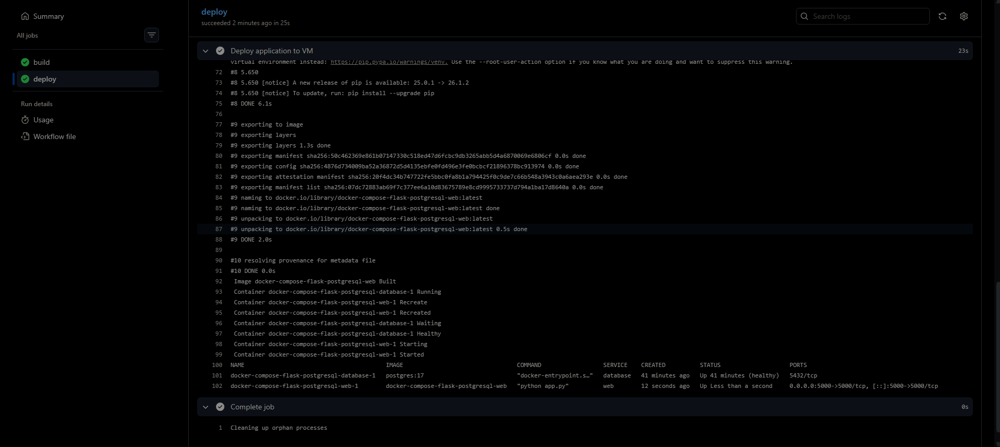
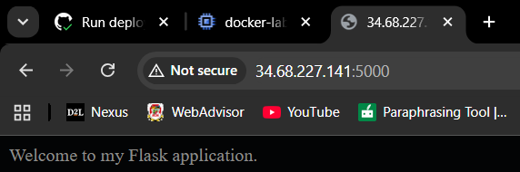

# Dockerized Flask + PostgreSQL

A multi container web application demonstrating Docker Compose orchestration, PostgreSQL integration, persistent storage, and production oriented containerization practices.


## Project Overview

This project demonstrates how to deploy a multi container web application using Docker Compose. A custom Flask web application communicates with a PostgreSQL database while following production oriented containerization practices such as persistent storage, environment variables, health checks, restart policies, and Docker networking.

---

## Objectives

- Containerize a Flask web application.
- Deploy PostgreSQL using the official Docker image.
- Orchestrate multiple containers using Docker Compose.
- Store database data using Docker volumes.
- Configure services using environment variables.
- Ensure the web application starts only after the database is healthy.
- Implement automatic container restart policies.
- Automate build validation and deployment using GitHub Actions.
- Deploy the application to a Google Cloud VM through SSH.

---

## Architecture

```text
                   Browser
                       │
                       ▼
                Flask Container
                       │
          Docker Internal Network
                       │
                       ▼
            PostgreSQL Container
                       │
                       ▼
                Docker Volume
```

---

## CI/CD Architecture

```text
Developer
   │
   │ git push
   ▼
GitHub Repository
   │
   ▼
GitHub Actions
   │
   ├── CI Job
   │      ├── checkout repository
   │      ├── build Docker image
   │      ├── start Docker Compose stack
   │      ├── verify running containers
   │      ├── run curl health check with retry logic
   │      ├── collect Docker Compose logs
   │      └── clean up services
   │
   └── Deploy Job
          ├── use GitHub Secrets
          ├── SSH into Google Cloud VM
          ├── git pull latest code
          ├── docker compose up -d --build
          ├── verify running containers
          └── live app available on port 5000
```

---

## Technologies Used

| Technology | Purpose |
|---|---|
| Docker | Containerization |
| Docker Compose | Multi container orchestration |
| Python | Backend language |
| Flask | Web framework |
| PostgreSQL | Database |
| Linux | Deployment environment |
| Google Cloud Platform | Virtual Machine hosting |
| GitHub Actions | CI/CD automation |
| GitHub Secrets | Secure storage for deployment values |
| SSH | Remote deployment connection |

---

## Project Structure

```text
Dockerized-Flask-PostgreSQL-Application/
│
├── .github/
│   └── workflows/
│       └── ci.yml
├── app.py
├── Dockerfile
├── docker-compose.yml
├── requirements.txt
├── README.md
└── Screenshots/
```

---

## Docker Concepts Demonstrated

- Docker Images
- Docker Containers
- Dockerfile
- Docker Compose
- Environment Variables
- Port Mapping
- Persistent Volumes
- Health Checks
- Restart Policies
- Docker Networking
- Service Discovery

---

## CI/CD Concepts Demonstrated

- GitHub Actions workflow automation
- CI pipeline triggered on push to `main`
- Docker image build validation
- Multi service Docker Compose validation
- HTTP health checks using `curl`
- Retry logic for application startup timing
- Log collection for failed or successful runs
- Cleanup using `docker compose down`
- GitHub Secrets for sensitive deployment values
- SSH based deployment to a Google Cloud VM
- Automated `git pull` and Docker Compose rebuild on the VM
- Deployment gated by successful CI checks

---

## Project Screenshots

### 1. Running Flask Container

The Flask application running inside a Docker container after building the custom image.


---

### 2. Flask Application in Browser

Verifies that the Flask application is accessible through the browser using Docker port mapping.


---

### 3. Docker Compose Startup

Docker Compose building the application, creating the network and volume, starting PostgreSQL, waiting for the database health check, and then launching the Flask service.


---

### 4. Browser Test After Docker Compose

Confirms the multi container application is successfully running after orchestration with Docker Compose.


---

### 5. Docker Compose Service Status

Shows both the Flask and PostgreSQL containers running successfully, with PostgreSQL reporting a healthy status.


---

### 6. Persistent Docker Volume

Displays the Docker volume used to persist PostgreSQL data across container restarts and recreation.


---

### 7. Docker Compose Network

Shows the automatically created Docker network that enables communication between the Flask and PostgreSQL containers using service names instead of IP addresses.


---

### 8. GitHub Actions CI Success

Shows the GitHub Actions workflow successfully completing the CI build and validation process.



---

### 9. Docker Image Build in CI

Shows the Docker image being built successfully inside the GitHub Actions runner.



---

### 10. Running Containers in CI

Shows the Flask and PostgreSQL containers running during the CI validation process.



---

### 11. HTTP Health Check Success

Shows the CI pipeline verifying the Flask application with a `curl` health check and retry logic.



---

### 12. GitHub Actions Secrets Configured

Shows the deployment secrets configured in GitHub Actions with sensitive values hidden.



---

### 13. SSH Deployment Connection Success

Shows GitHub Actions successfully connecting to the Google Cloud VM over SSH.



---

### 14. Automated Deployment Success

Shows the GitHub Actions build and deploy jobs completing successfully.



---

### 15. Deployment Logs on VM

Shows the deployment job pulling the latest code, rebuilding the Docker Compose stack, and verifying the running containers on the VM.



---

### 16. Live App After Automated Deployment

Shows the Flask application running live from the Google Cloud VM after automated deployment.



---

## How to Run Locally

Clone the repository:

```bash
git clone https://github.com/adnanhadi10/docker-compose-flask-postgresql.git
```

Move into the project directory:

```bash
cd Dockerized-Flask-PostgreSQL-Application
```

Build and start the application:

```bash
docker compose up --build
```

Open the application in a browser:

```text
http://localhost:5000
```

Stop the application:

```bash
docker compose down
```

---

## Key Engineering Decisions

- Used the official PostgreSQL image instead of creating a custom database image.
- Used Docker Compose to orchestrate multiple containers.
- Stored configuration using environment variables instead of hardcoding credentials.
- Used a Docker volume to provide persistent database storage.
- Used Docker service names instead of IP addresses for container communication.
- Configured a health check so the web application starts only after PostgreSQL is ready.
- Kept PostgreSQL on the internal Docker network instead of exposing it publicly to reduce attack surface.
- Configured restart policies to improve service availability.
- Added CI validation before deployment to avoid deploying broken changes.
- Used GitHub Secrets instead of hardcoding VM credentials or private keys.
- Used SSH based deployment so GitHub Actions can update the VM automatically.
- Added retry logic because a running container does not always mean the application is ready.
- Removed `sudo` from deployment commands by allowing the VM user to run Docker through the Docker group.

---

## CI/CD Pipeline

This project includes a CI/CD pipeline built with GitHub Actions to automate build validation and deployment of a Dockerized Flask and PostgreSQL application.

The pipeline is triggered whenever code is pushed to the `main` branch.

### CI Workflow

The CI job validates the application before deployment by performing the following steps:

1. Checks out the repository on a GitHub hosted Ubuntu runner
2. Builds the Docker image using the project Dockerfile
3. Starts the full multi service stack using Docker Compose
4. Verifies running containers with `docker ps`
5. Sends an HTTP request to the Flask application using `curl`
6. Uses retry logic to handle application startup timing
7. Collects Docker Compose logs for troubleshooting
8. Cleans up containers and networks using `docker compose down`

The health check was added because a running container does not always mean the application is ready. The pipeline verifies that the Flask app responds successfully before the CI job passes.

### CD Workflow

After the CI job passes, the deployment job runs automatically.

The deployment job:

1. Uses GitHub Secrets to access VM connection details securely
2. Sets up an SSH private key on the GitHub Actions runner
3. Connects to a Google Cloud VM over SSH
4. Pulls the latest code from GitHub
5. Rebuilds and restarts the Docker Compose stack
6. Verifies the running containers after deployment

Deployment only runs after the CI job succeeds. This prevents broken or unverified code from being deployed to the VM.

### Secrets Used

The following GitHub repository secrets are used by the deployment job:

| Secret Name | Purpose |
|---|---|
| `VM_HOST` | External IP address of the Google Cloud VM |
| `VM_USER` | Linux username used for SSH |
| `VM_PROJECT_PATH` | Path to the cloned project folder on the VM |
| `VM_SSH_KEY` | Private SSH key used by GitHub Actions |

Sensitive values are stored in GitHub Secrets instead of being hardcoded in the repository.

### Deployment Flow

```text
git push
   │
   ▼
GitHub Actions
   │
   ├── Build and validate application
   │
   ├── Run Docker Compose health checks
   │
   └── SSH into Google Cloud VM
          │
          ├── git pull origin main
          ├── docker compose up -d --build
          ├── docker compose ps
          └── live app available on port 5000
```

---

## Troubleshooting and Lessons Learned

Several real CI/CD and deployment issues were identified and resolved during this project:

| Issue | Cause | Resolution |
|---|---|---|
| Health check failed in CI | The Flask container started, but the application was not ready to respond immediately | Added retry logic to the `curl` health check |
| Logs were skipped after failure | The Docker Compose logs step only ran after successful previous steps | Added `if: always()` so logs are collected even when health checks fail |
| SSH connection timed out | The Google Cloud VM external IP changed after the VM was restarted | Updated the `VM_HOST` GitHub Secret with the current VM IP |
| SSH authentication failed | The deployment public key was not associated with the correct Linux user on the VM | Added the public key to the VM SSH keys with the correct username |
| Sudo required a password | GitHub Actions could not enter an interactive sudo password during deployment | Added the VM user to the Docker group and removed `sudo` from deployment commands |
| `git pull` could not run on the original VM folder | The existing VM folder was copied manually and was not a Git repository | Cloned the GitHub repository properly on the VM and updated `VM_PROJECT_PATH` |

These issues helped reinforce important DevOps concepts including health checks, retry logic, SSH key based authentication, GitHub Secrets, Linux permissions, Docker group access, and deployment troubleshooting.

---

## What I Learned

Through this project I learned how Docker Compose simplifies multi container deployments by automatically creating networks, managing service dependencies, and orchestrating application startup. I also gained practical experience using persistent volumes, environment variables, health checks, restart policies, and Docker networking while deploying a Flask application connected to a PostgreSQL database.

I also learned how CI/CD pipelines improve reliability by validating code before deployment. GitHub Actions was used to build the Docker image, start the Compose stack, test the application with an HTTP health check, collect logs, and clean up test containers.

The deployment portion helped me understand how GitHub Actions can securely deploy to a cloud VM using SSH and GitHub Secrets. I also learned how to troubleshoot real deployment failures involving VM IP changes, SSH keys, Linux permissions, Docker group access, and Git repository setup on the server.

---

## Final Outcome

The final result is a Dockerized Flask and PostgreSQL application with an automated GitHub Actions pipeline that validates the application and deploys it to a Google Cloud VM after successful CI checks.

The project demonstrates both container orchestration and automated deployment, making it closer to a real world DevOps workflow than a basic local Docker setup.