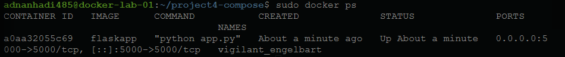
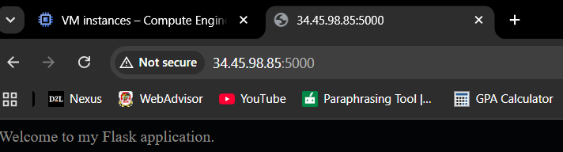
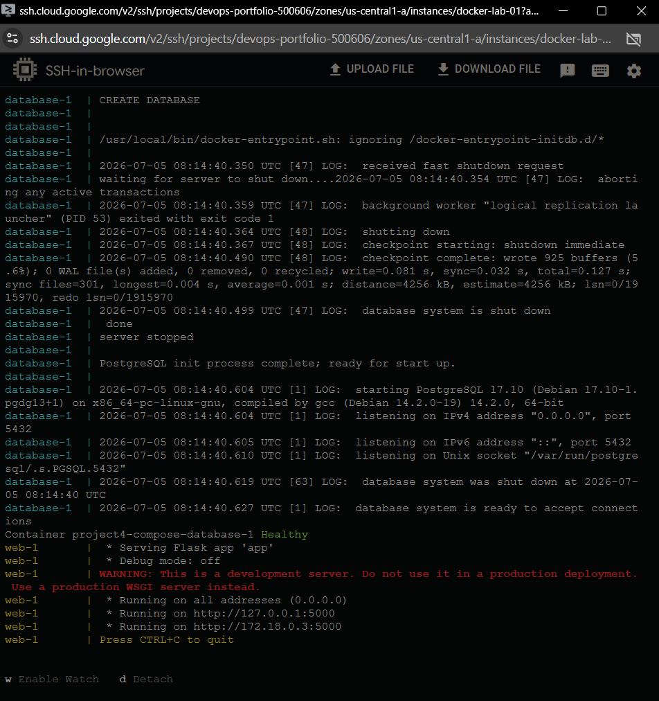
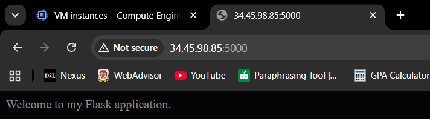
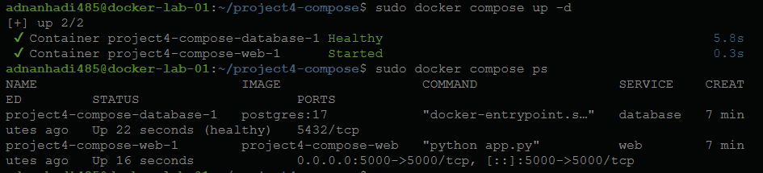
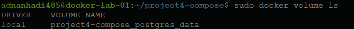
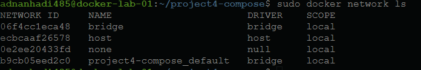

# Dockerized Flask & PostgreSQL Application

## Project Overview

This project demonstrates how to deploy a multi container web application using Docker Compose. A custom Flask web application communicates with a PostgreSQL database while following production oriented containerization practices such as persistent storage, environment variables, health checks, restart policies, and Docker networking.

---

## Objectives

- Containerize a Flask web application.
- Deploy PostgreSQL using the official Docker image.
- Orchestrate multiple containers using Docker Compose.
- Store database data using Docker volumes.
- Configure services using environment variables.
- Ensure the web application starts only after the database is healthy.
- Implement automatic container restart policies.

---

## Architecture

```text
                   Browser
                       │
                       ▼
                Flask Container
                       │
          Docker Internal Network
                       │
                       ▼
            PostgreSQL Container
                       │
                       ▼
                Docker Volume
```

---

## Technologies Used

| Technology | Purpose |
|------------|---------|
| Docker | Containerization |
| Docker Compose | Multi container orchestration |
| Python | Backend language |
| Flask | Web framework |
| PostgreSQL | Database |
| Linux | Deployment environment |
| Google Cloud Platform | Virtual Machine hosting |

---

## Project Structure

```text
Dockerized-Flask-PostgreSQL-Application/
│
├── app.py
├── Dockerfile
├── docker-compose.yml
├── requirements.txt
├── README.md
└── Screenshots/
```

---

## Docker Concepts Demonstrated

- Docker Images
- Docker Containers
- Dockerfile
- Docker Compose
- Environment Variables
- Port Mapping
- Persistent Volumes
- Health Checks
- Restart Policies
- Docker Networking
- Service Discovery

---

## 📸 Project Screenshots

### 1. Running Flask Container

The Flask application running inside a Docker container after building the custom image.



---

### 2. Flask Application in Browser

Verifies that the Flask application is accessible through the browser using Docker port mapping.



---

### 3. Docker Compose Startup

Docker Compose building the application, creating the network and volume, starting PostgreSQL, waiting for the database health check, and then launching the Flask service.



---

### 4. Browser Test After Docker Compose

Confirms the multi container application is successfully running after orchestration with Docker Compose.



---

### 5. Docker Compose Service Status

Shows both the Flask and PostgreSQL containers running successfully, with PostgreSQL reporting a healthy status.



---

### 6. Persistent Docker Volume

Displays the Docker volume used to persist PostgreSQL data across container restarts and recreation.



---

### 7. Docker Compose Network

Shows the automatically created Docker network that enables communication between the Flask and PostgreSQL containers using service names instead of IP addresses.



---

## How to Run

Clone the repository:

```bash
git clone <repository-url>
```

Move into the project directory:

```bash
cd Dockerized-Flask-PostgreSQL-Application
```

Build and start the application:

```bash
docker compose up --build
```

---

## Key Engineering Decisions

- Used the official PostgreSQL image instead of creating a custom database image.
- Used Docker Compose to orchestrate multiple containers.
- Stored configuration using environment variables instead of hardcoding credentials.
- Used a Docker volume to provide persistent database storage.
- Used Docker service names instead of IP addresses for container communication.
- Configured a health check so the web application starts only after PostgreSQL is ready.
- Kept PostgreSQL on the internal Docker network instead of exposing it publicly to reduce attack surface.
- Configured restart policies to improve service availability.

---

## What I Learned

Through this project I learned how Docker Compose simplifies multi container deployments by automatically creating networks, managing service dependencies, and orchestrating application startup. I also gained practical experience using persistent volumes, environment variables, health checks, restart policies, and Docker networking while deploying a Flask application connected to a PostgreSQL database.
